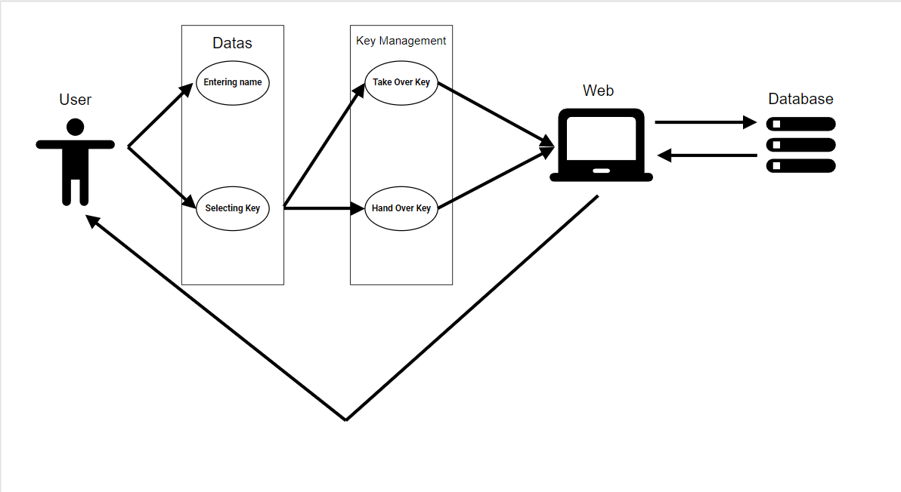
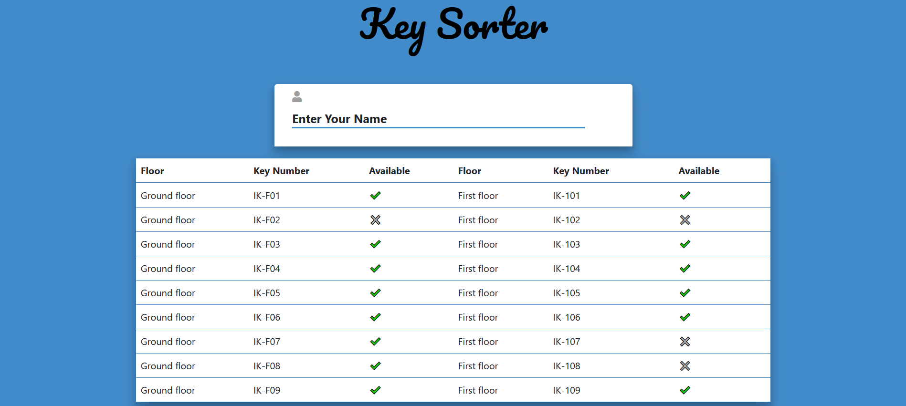
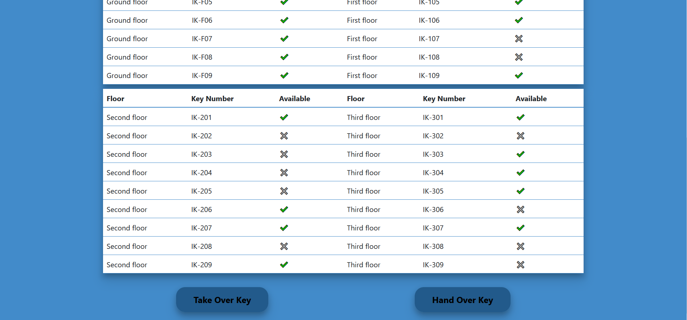

# Kulcs felvételi rendszer szimulátor.

Webes alkalmazás, amely segítségével a DE-IK épület kulcsait vehetjük fel, adhatjuk le és kérhetjük le elérhetőségüket.
  

## Kulcs felvétel/leadás menete:  
Az oldal kötelez egy név megadására, illetve egy elérhető. vagy leadni kívánt kulcs kijelölésére. Hibaüzenet jelzi ha valamelyik lépés kimaradt. Ezután a *Take Over Key* gomb megnyomásával van lehetőség felvenni a kulcsot. Amennyiben leszeretnénk adni a kulcsot, azt a *Hand Over Key* gomb megnyomásával tehetjük meg. A felvétel időpontja automatikusan rögzítésre fog kerül.
  

## Funkcionalitás:  
Az oldalon a felhasználó először egy táblázattal találkozik, ahol látja az összes elérhető és nem elérhető kulcsot.

Adott terem kulcsára kattintva van lehetőség a kulcsok kiválasztására. Kulcsot akkor lehet felvenni, ha az elérhető, ezt a sorában lévő ikon jelzi. Az elérhetőséget zöld pipa jelzi, ellenkező esetben egy nagy X látható. Kulcs kijelölésével a sor színe megváltozik. 
  

A programot HTML, CSS és JavaScript, valamint Bootstrap segítségével hoztuk létre.   

  

  
## Követelmény: 
- Valós időben jelenítse meg az elérhető, illetve nem elérhető kulcsokat.
- Kulcsfelvétel során kihagyott lépések esetén tájékoztatja a felhasználót a hiányzó adatokról
- Tájékoztatja a felhasználót sikeres kulcsfelvétel esetén

Az adatok az adott session-ben vannak tárolva  

Támogatott böngészők: Mozilla, Chrome, Opera, Edge, Safari 
Támogatott eszközök: PC, laptop, telefon, tablet
  
## Későbbi követelmények:
- A későbbiekben kulcsot a csak erre jogosult személyek vehetik fel. 
- A jogosult személyek adatai tárolva lesznek.
- Nem jogosult személy adatait beírva az oldal tájékoztatni fogja a felhasználót, hogy számára a kulcs felvétel nincs engedélyezve
- Minden adat tárolva lesz így bármikor valós adatokat tudunk meg a kulcsokról.
- A már felvett kulcsok esetén lesz lehetőség megnézni ki vette fel azokat.

